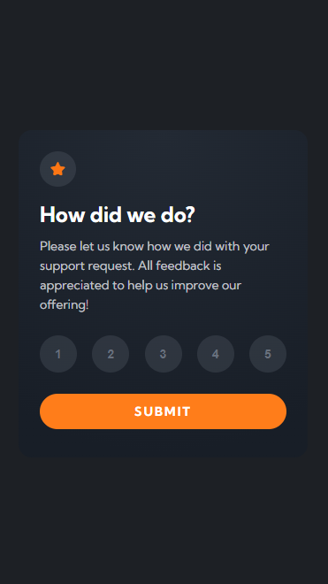
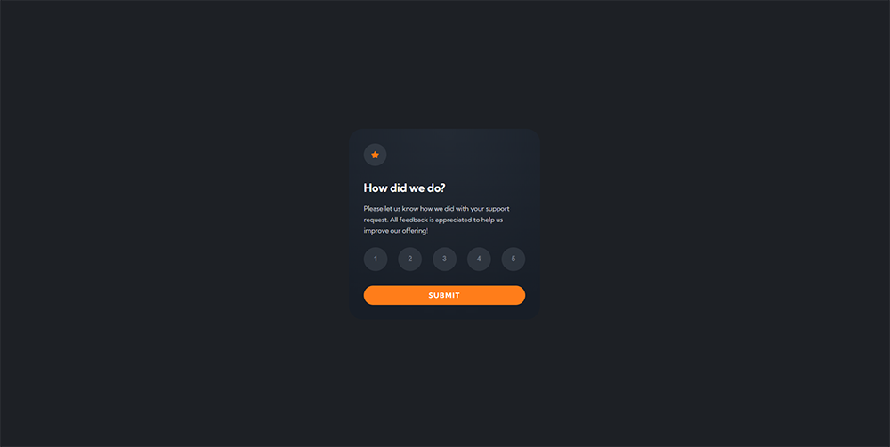

# Frontend Mentor - Interactive rating component solution

This is a solution to the [Interactive rating component challenge on Frontend Mentor](https://www.frontendmentor.io/challenges/interactive-rating-component-koxpeBUmI). Frontend Mentor challenges help you improve your coding skills by building realistic projects.

## Table of contents

- [Overview](#overview)
  - [The challenge](#the-challenge)
  - [Screenshot](#screenshot)
  - [Links](#links)
- [My process](#my-process)
  - [Built with](#built-with)
  - [What I learned](#what-i-learned)
  - [Continued development](#continued-development)
  - [Useful resources](#useful-resources)
- [Author](#author)
- [Acknowledgments](#acknowledgments)

## Overview

### The challenge

Users should be able to:

- View the optimal layout for the app depending on their device's screen size
- See hover states for all interactive elements on the page
- Select and submit a number rating
- See the "Thank you" card state after submitting a rating

### Screenshot

 

### Links

- Solution URL: [Github](https://github.com/Kijimai/fem-interactive-react)
- Live Site URL: [Netlify](https://interactive-rating-component-reactjs.netlify.app/)

## My process

### Built with

- ReactJS
- SCSS

### What I learned

This project was created so that I could improve on both React and SCSS. Specifically, I wanted to refresh my knowledge of React and create a reusable component that was also styled using SCSS with the BEM methodology.

## Author

- Website - [Personal Portfolio](https://jdbucog.netlify.app/)
- Frontend Mentor - [@Kijimai](https://www.frontendmentor.io/profile/Kijimai)

